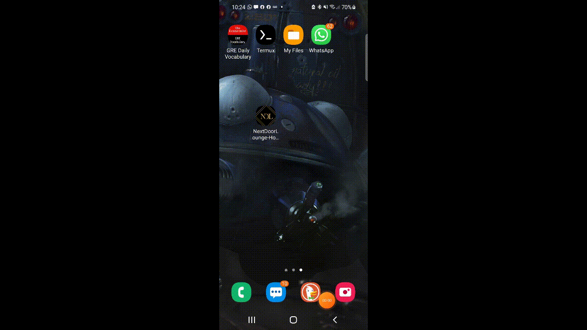
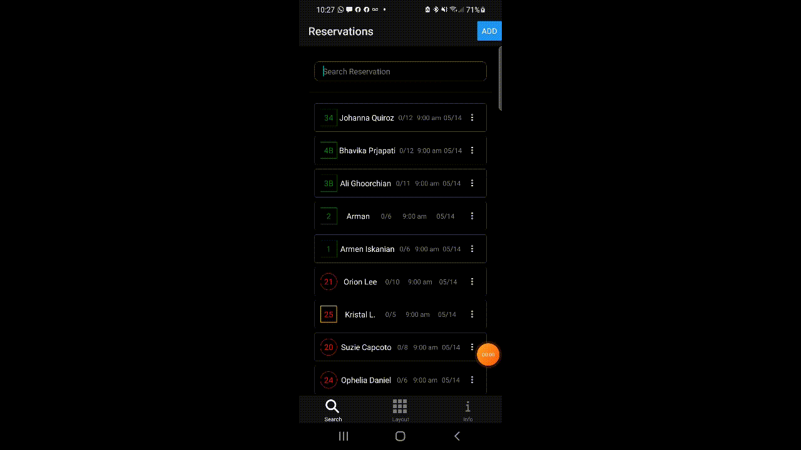
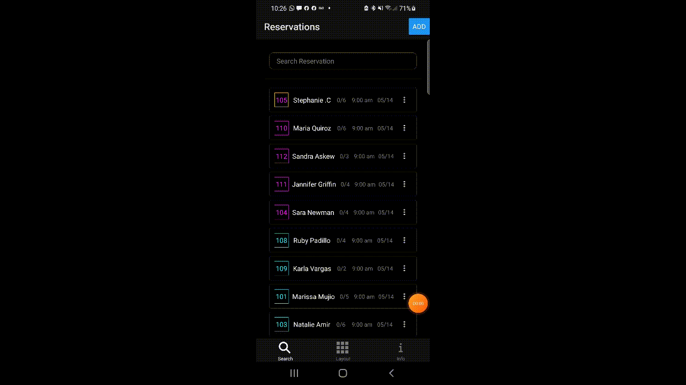
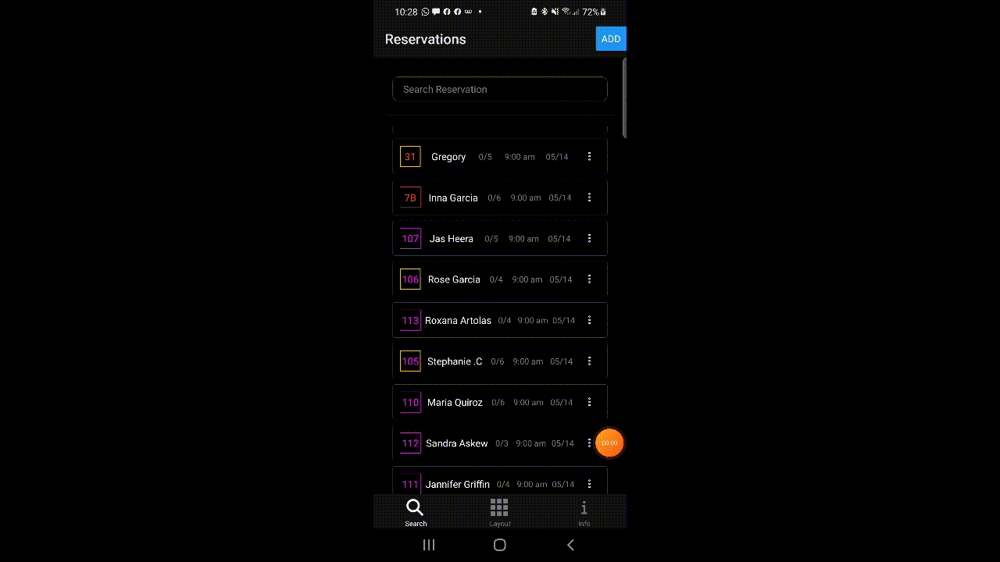
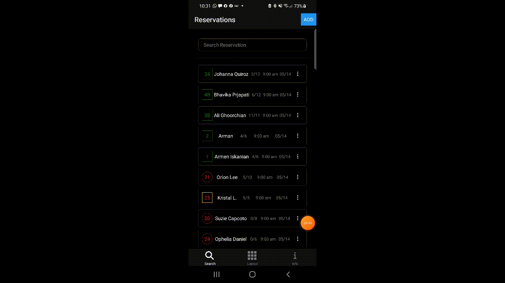
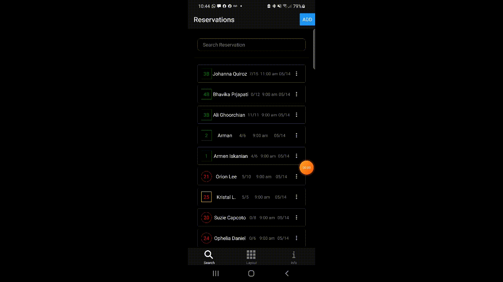
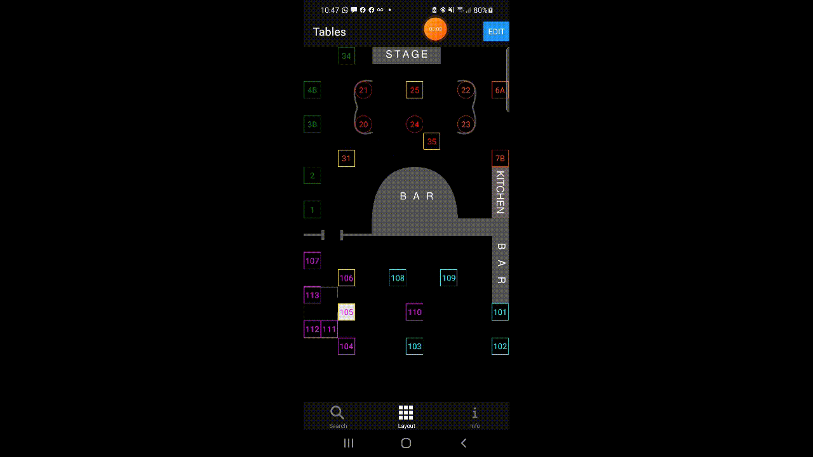
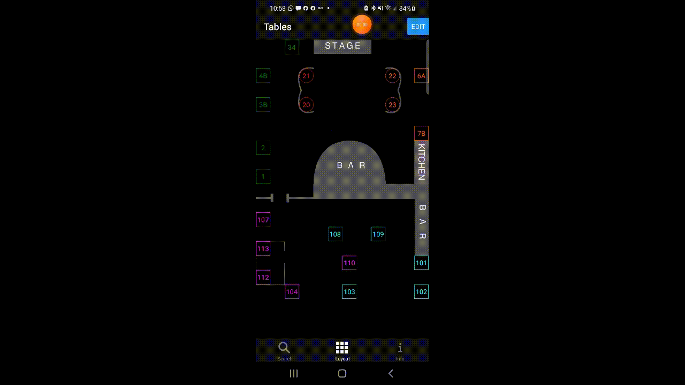

# Next Door Lounge Host App

Hello there.Ths is app I designed for Next Door Lounge. It helps the staff to keep track of the reservations and table of the restaurant. I design it to be easy to use an intuitive. It uses a firebase server to comunicate chnget in real time across the all the apps.

I used React Native, and designt it to be able to run on IOS, Android and Web.

## Install
The iPhone build can be found here:
>https://exp-shell-app-assets.s3.us-west-1.amazonaws.com/ios/%40telix/NextDoorLounge-HostApp-5461de49-ea33-4f39-b8ce-293060366dfb-simulator.tar.gz

The Android build can be found here:
>https://exp-shell-app-assets.s3.us-west-1.amazonaws.com/android/%40telix/NextDoorLounge-HostApp-23634c92e4724b09878547bedad07eb0-signed.apk

## Usage

The solution that I set out to find with this app is about communication more efficiently with everyone and a shorten the amount of time it takes to look at a table that belongs to a reservation.

Every night, changes happen: reservations get canceled, tables get switched, people get added.
Everyone should know about these changes, but it takes time to track everyone down, tell them, and make a drawing on their table sheets.
That why thought: What if we could have the table sheet, live on our phone?  This way If anyone needs to make a change, we can all see it in real-time.
It would be easier to communicate with everyone and with everyone helping in it would be easy to see how the restaurant is doing just by having your phone and signal.

To be able to sit all the information on a small screen, I have divided the app into three sections.:
One for the reservations, one for the tables, and one for the changes and updates.

The reservations tabs include a search bar to quickly search for the reservations name, this way the customer does not have to wait until Selina or I peruse through the table sheet to find the name.  Sometimes it can be hard to hear the name of a reservation, that why the search work with any syllable.

#### Reservation Tab
If you tap on reservations it takes directly to the table that the reservation belongs to on the table tab. That way waste no time finding the table.

You can search a reservation by typing in the search bar.

We can also delete a reservation or edit existing reservations.

We can view the details of a reservation by taping an holding, see the notes attached to it, see if they are VIP at the time and table they are going to.

#### Table Tab

On the table tab, we can tap on a table and we get all the information on that table, including the reservation it has.
A table is marked by color and the color changes depending on the waiter that is assigned to that table. All the information on the table can be edited and changed, the golden border on the table represents that it has a VIP reservation.

The Table tab is also highly customizable. One can delete any table by dragging it to the trash bin.

Or create a table anywhere by dragging a table anywhere on the screen.

#### Log Tab
The Last tab records and presents all the changes that anyone makes: The idea is that everyone can keep track of what is happening in the restaurant.

The logs include the user who made the changes as well as the change that was made.
There is also the ability to write your own messages to explain some changes that happened or convey important information to everyone.

When a change has been made to a table or reservation, if the user is involved in that table then it would send them a notification.
For example, if two tables are switched, then waiters of that table would get a notification of the switch.

This would conclude the basic preview of the app.

Feel free to copy the code or modify it in any way.

